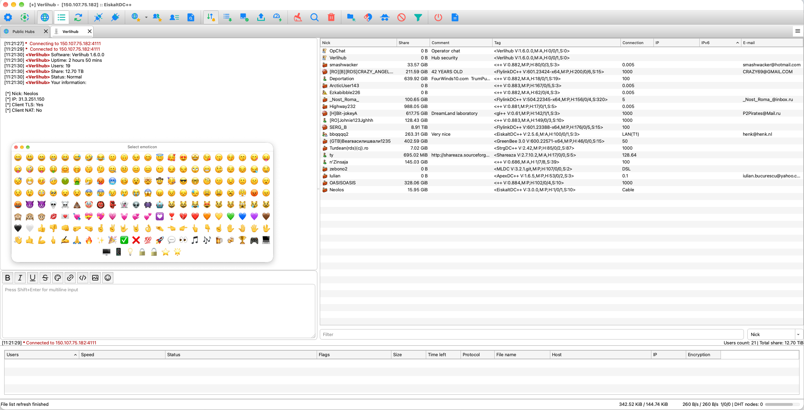
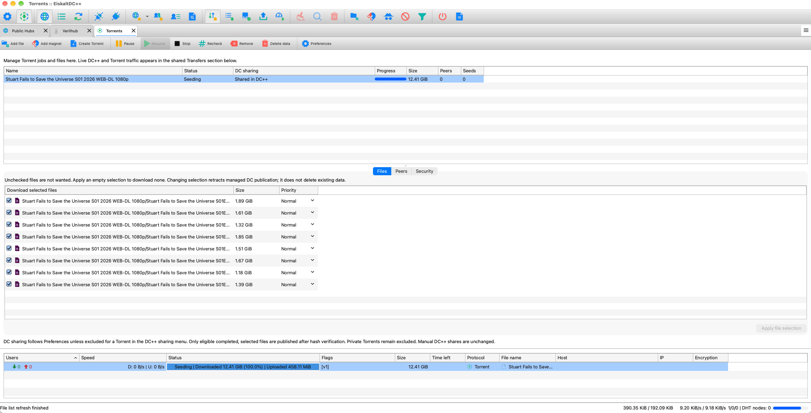

# EiskaltDC++ 3 Development

A native Qt desktop client for **Direct Connect and BitTorrent**, with shared
transfer monitoring, hub chat and controlled publication of completed Torrent
files to DC++.

This repository contains the current 3.x development work. **`v3.0.0-pre.1` is
being prepared, not yet published.** Use the
[Releases page](https://github.com/Delitants/eiskaltdcpp/releases) for published
builds; a development screenshot or successful local build is not a release.

## Current Work

- DC/NMDC, ADC and their TLS variants, hub and private chat, search, file lists,
  download queues and TTH-based sharing.
- An integrated Torrents tab: add files or magnets, create Torrents, pause,
  resume, stop, recheck, choose files and priorities, and inspect connected peers.
- One transfer row per Torrent with download/upload activity. Stopped Torrents
  remain manageable in the Torrents tab rather than cluttering live transfers.
- Optional DC publication of verified, selected, completed non-private Torrent
  files, with a per-Torrent exclusion and reusable hash state.
- Global and Torrent-only proxy profiles, including authenticated GOST TLS with
  UDP tunneling. Torrent routing covers peers, DHT and trackers together.
- Peer encryption controls, country blocking and optional rejection of
  unrecognized initial BitTorrent peer IDs. These are controls, not an anonymity
  guarantee or proof that an unfamiliar client is malicious.
- Native toolbar/tab navigation, icon-based chat formatting, file-type icons,
  persistent column widths and a categorized Live Log.
- DC certificate lifecycle management and an off-by-default option to omit the
  DHT capability from hub advertisements without changing DHT enablement.

The Torrent backend is optional and currently requires Qt6 and
**libtorrent-rasterbar 2.1+**. DC and Torrent pieces are **not combined** into one
cross-protocol download. Legacy frontends and DC-only builds do not automatically
include the new Torrent UI.

## Screenshots

Current macOS development interface, supplied by the maintainer. Other platforms
and themes may differ.

### Hub Chat



### Torrents



## Documentation

- [Getting started](docs/wiki/Getting-Started.md)
- [Torrents and DC sharing](docs/wiki/Torrents.md)
- [Proxy routing and certificates](docs/wiki/Proxy-and-TLS.md)
- [Troubleshooting and reporting bugs](docs/wiki/Troubleshooting.md)
- [Build and test guide](docs/torrent-building.md)
- [Windows development](windows/README.txt)
- [General build instructions](INSTALL)
- [Development status and release gates](docs/wiki/Development-Status.md)
- [Project wiki](https://github.com/Delitants/eiskaltdcpp/wiki)

The Markdown pages in `docs/wiki` are the maintained source for the project
wiki and remain usable before wiki publication.

## Build And Test

See the build guide for dependencies and platform-specific packaging. A typical
Torrent-enabled developer configuration is:

```sh
cmake -S . -B build-torrent \
  -DUSE_QT6=ON -DUSE_GTK3=OFF -DUSE_TORRENT=ON \
  -DBUILD_TESTS=ON -DCMAKE_BUILD_TYPE=Release
cmake --build build-torrent -j2
ctest --test-dir build-torrent --output-on-failure
```

Tests use temporary data and some require permission for loopback sockets. Live
proxy acceptance tests are separate and opt-in. Do not point test profiles at
personal shares or downloads.

Current verification is primarily macOS development work. Windows/Linux Torrent
packaging and older macOS compatibility need independent verification. In
particular, a bundle linked against newer macOS dependencies must not be
advertised as supporting an older system just because its deployment target is
lower. Do not ship bundles with external Homebrew library dependencies.

The v3 macOS release targets separate **Intel-only macOS 14+** and
**Apple-Silicon-only macOS 26+** ZIPs, explicitly named by architecture and minimum
OS. See [macOS release builds](macos/RELEASE.md) for filenames, build presets and
whole-bundle validation. These targets do not imply both artifacts or native
minimum-OS acceptance are already complete.

## Contributing

Report reproducible bugs in [Issues](https://github.com/Delitants/eiskaltdcpp/issues),
including the version, OS, steps and relevant sanitized logs. Never attach
passwords, private keys, full private profiles or proxy deployment configuration.
Translation and native-speaker review are welcome; automated catalog checks do
not establish linguistic quality.

## License And Credits

EiskaltDC++ continues the work of its upstream developers and the Direct Connect
community. See [AUTHORS](AUTHORS), [COPYING](COPYING), [LICENSE](LICENSE),
[ChangeLog.txt](ChangeLog.txt) and the [fork changelog](CHANGELOG_FORK_DELTA.md).
The project's `COPYING` file specifies the GNU General Public License, version 3
or later, with an OpenSSL linking exception. Individual source files and bundled
components retain their own notices and licenses.
See the [release notice inventory](docs/third-party-release-inventory.md) for
the added icon families, modified Cocoa plugin and pending binary notice checks.
